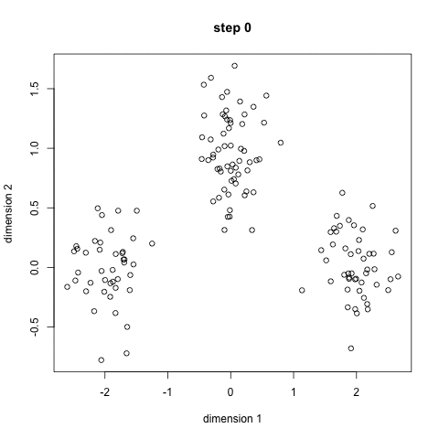

**A primer on cluster analysis**

The main purpose of cluster analysis is to group previously unstructured data into, say ${{\bf y}_1, \ldots, {\bf y_n}}$, where ${\bf y}_i$ is an $n$-dimensional vector, into distinct groups consisting of subsets of the data that are similar to each other under some metric. 

In scientific applications, one expects the discovered clusters to hold some meaningful interpretation. However, there are no external criteria by which to define them. Instead, cluster analysis depends on some internal criterion defined directly from the data. This criterion evaulates each partition ${\bf S}$ of the $N$ observations into $K$ groups through some function $c({\bf S}) \in \mathbb{R}$, measuring the adequacy of each partition. A sensible clustering will then be the partitions which minimizes or maximizes $c({\bf S})$.

Clustering algorithms can either have a fixed number $K$ of clusters to be discovered, or can try to discover an optimal $K$. In addition, clustering algorithms can either be deterministic or probabilistic.

Model-based clustering is a class of clustering methods which give a probability distribution over the clusters. Often, we assume the data ${{\bf y}_1, \ldots, {\bf y_n}}$ follows some finite mixture distribution, typically Gaussian. That is, the vector ${\bf y}_i$ is considered a draw from a random variable ${\bf Y}$ from a multivarate mixture distribution:
$$ p({\bf y}_i | {\bf \theta}, {\bf \eta}) = \sum_{k=1}^K \eta_k p({\bf y}_i | {\bf \theta}_k) $$
Where $\eta_k \in [0,1]$ with constraint $\sum_{k=1}^K \eta_k$ = 1 and ${\bf \theta}$ is the parameter space for probability denisity $p$. If we are assuming a Guassian mixture model, $p$ is the Gaussian density function and ${\bf \theta} = ({\bf \mu}, {\bf \sigma}^2)$. 

Model based clustering has the advantage of returning probability calls for each sample belonging to a particular component, as opposed to the "hard" assignments returned by methods such as k-means. As we are assuming a distribution for the data, we can obtain a likelihood for the fitted model making it possible to perform model selection and goodness of fit tests.

**K-means clustering**

K-means clustering is a very popular deterministic clustering algorithm. While it does not give probabilistic assignment calls, it benefits from being extremely fast and is often used to find starting values for more sophisticated clustering algorithms. Its objective is to minimize the within cluster sum of squares. That is, find the  partitioning of the data ${\bf S} = \{S_1, S_2, \ldots, S_K \}$ such that
$$ {\bf S} = {\operatorname{arg\,min}}_{{\bf S}} \sum_{k=1}^{K} \sum_{\mathbf y \in S_k} \left\| \mathbf y - \boldsymbol\mu_k \right\|^2$$
Where $K$ is the total number of components and $\mu_k$ is the mean of $S_k$. 

A standard algorithm for finding ${\bf S}$ is:

1. Randomly assign objects to clusters. 
2. Calculate the mean of each cluster.
3. Check assignments for all the objects. If another center is closer to an object, reassign the object to that cluster.
4. Repeat steps 2-3 until no reassignments occur

Since the solution will be a local max, in practice the algorithm is peformed several times with multiple starting values. 

Below is an animated gif created by Rafael Irizarry for [Simply Statistics](http://simplystatistics.org) for illustrating the algorithm in action.

**Model-based clustering?**

As mentioned before, model-based clustering attempts to fit a mixture of distributions (usually normal) to the data and use the fitted distribution to classify. A variety of algorithms exist for estimating the parameters of the mixture distribution, the most popular being EM and Gibbs Sampling.

**Model selection**

When fitting finite mixture models to a dataset, the goal is to maximize the log likelihood to find a model that fits the data well. However, introducing more parameters to the model will always increase the log likelihood, so models with more components will always be favored. To avoid this overfitting, a penalty term can be introduced. The most popular likelihood penalization criterion is the Bayesian information Criterion (BIC):
$$ BIC = 2\log L_M (y, θ_k^∗) − p_M \log(n) $$
Where $\log L_M (y, θ_k^∗)$ is the maximized loglikelihood for the model and data, $p_M$ is the number of independent parameters for model $M$, and $n$ is the number of observerations in the data.

An alternative criterion is the Integrated Classification Likelihood (ICL), which is a more robust criterion developed specifically for clustering applications. The ICL considers the full likelihood $L_M (y, z, \theta_k)$ where $z$ is the vector of latent variables. It can be viewed similar to BIC except with an added penalty term for the entropy of the distribution. As a result, the for model $M$, $ICL(M) \leq BIC(M)$.For more information, see:

Biernacki, C., Celeux, G., Govaert, G. (2000). Assessing a mixture model for clustering with the integrated completed likelihood. IEEE Trans. Pattern Analysis and Machine Intelligence, 22 (7), 719-725.

**Further developments**

This tutorial focuses on clustering via Guassian mixture models. In real data examples, it is rare to see perfect normality. Slight deviations from normality, such as a component being skewed or having high kurtosis, or the presence of outliers can lead to models overfit with spurious components being favored by the likelihood penalization methods.

A number of methods exist to deal with these shortcomings. One popular technique is to also include an outlier component in the form of a uniform distribution across the range of the data, to catch observations that do not fit well in any of the normal components. For added robustness, it is also possible to cluster using mixtures of skewed normal and t-distributions.